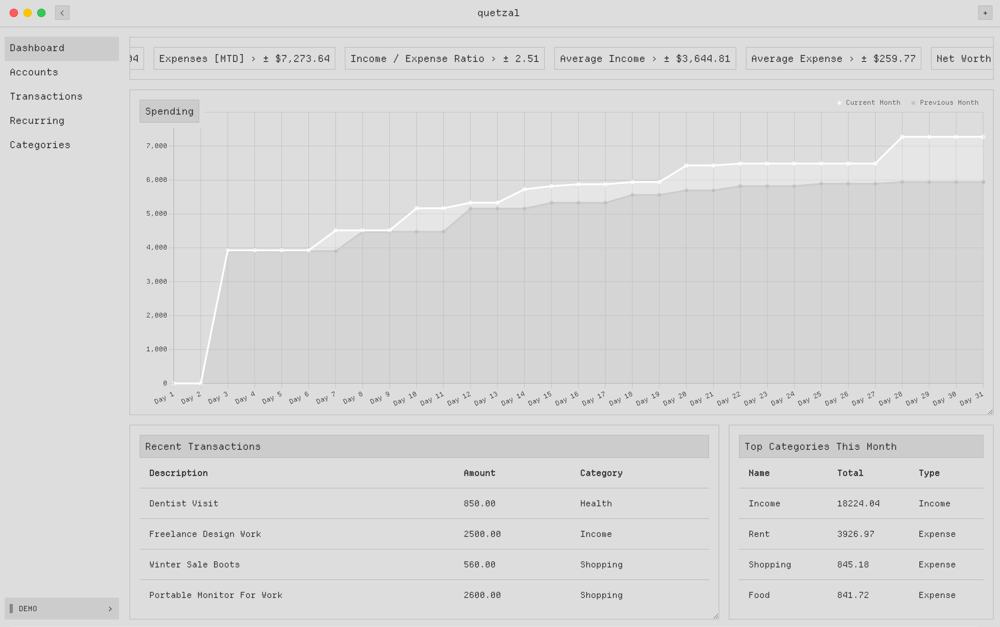
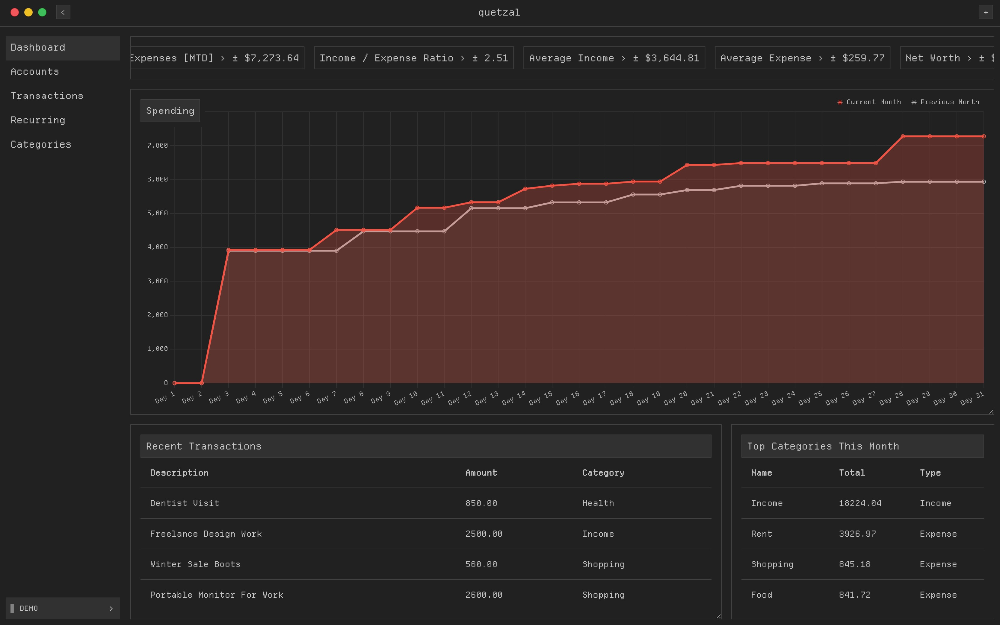

# quetzal.

A minimalist personal finance manager built with JavaScript & Python. It allows the user to manage & visualise transactions in multiple currencies with built-in authentication & support for multiple users.


| Light | Dark |
|-------|------|
|  |  |

## features.

- Token-based user authentication with registration/login/logout.
- Record income, expenses & transfers between accounts.
- User-defined account types e.g. bank, cash or investments
- Customizable income/expense categories.
- Track finances in over 150 currencies with automatic conversion.
- Filter transactions by specific date ranges.
- Visualise aggregate income, expenses & net worth.
- Export transaction data to CSV.

## installation.

*check release tab for platform specific builds.*

### for developers.

**Prerequisites**: Python 3.10+, pip3, npm

```sh
# 1. clone the repository.
git clone https://github.com/neintendo/quetzal.git
cd quetzal

# 2. create & switch to a virtual environment.

# 3. install backend dependencies.
pip3 install -r requirements.txt

# 4. build python installer (for electron).
pyinstaller quetzal_django.spec

# 5. build & package application into electron.
cd quetzal_react
npm install
npm run build
npm run package

# after packaging, the executable is located in /quetzal_react/out
```
